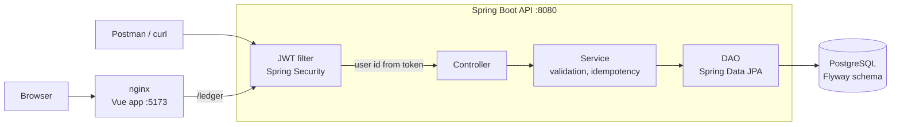

<div align="center">

# Secure Ledger API

**Spring Boot REST API to record and review financial transactions**


</div>

This is the backend of Secure Ledger, the Vue frontend is in [secure-ledger-frontend](https://github.com/AwosKanaan/secure-ledger-frontend)

## Features

- JWT authentication with BCrypt passwords
- Users see only their own data
- Validation for amount, currency and IBAN
- Idempotent `POST` with `Idempotency-Key`
- Paginated history with date filter and sorting
- Flyway migrations and OpenAPI docs

## Getting started

Clone both repositories in same folder, then start PostgreSQL, the API and the frontend

```bash
git clone https://github.com/AwosKanaan/secure-ledger.git
git clone https://github.com/AwosKanaan/secure-ledger-frontend.git
cd secure-ledger
docker compose up --build
```

| Service    | URL                                   |
|------------|---------------------------------------|
| Frontend   | http://localhost:5173                 |
| API        | http://localhost:8080/ledger          |
| Swagger UI | http://localhost:8080/swagger-ui.html |
| Health     | http://localhost:8080/actuator/health |

Demo accounts are `gilbert@gmail.com` / `gilbert123` and `bob@ledger.test` / `Ledger-Test-2026!`

To call the API directly, import [`postman_collection.json`](postman_collection.json) and run **Login as Gilbert** first

## API

| Method | Path                   | What it does                       |
|--------|------------------------|------------------------------------|
| POST   | `/ledger/auth/login`   | Login with email and password, returns JWT |
| POST   | `/ledger/transactions` | Create a transaction               |
| GET    | `/ledger/transactions` | Paginated transaction history      |

```http
POST /ledger/transactions
Authorization: Bearer <token>
Idempotency-Key: 6f1c2e0a-3b9d-4c55-9a51-2f4b8d7e1c90

{ "amount": "125.50", "currency": "EUR", "description": "Invoice 42",
  "counterpartyIban": "DE89 3704 0044 0532 0130 00" }
```

```http
GET /ledger/transactions?startDate=2026-01-01&endDate=2026-03-31&sort=amount,asc&page=1&size=10
```

- `startDate` and `endDate` are inclusive dates in UTC
- `sort` can be `createdAt` or `amount` with `asc` or `desc`, default is `createdAt,desc`
- `page` start from 1, `size` is 10 by default and max 100
- Sending same `POST` again with same `Idempotency-Key` returns the original transaction
- Same key with different body returns `422` with `"code": "IDEMPOTENCY_KEY_REUSED"`

Errors are JSON with `status`, `message` and for validation errors also list of fields

```json
{ "status": 422, "message": "Validation failed",
  "errors": [{ "field": "amount", "message": "must be greater than 0" }] }
```

## Architecture



```
org.secureledger
├── controller   endpoints and error handling
├── service      business logic
├── dao          data access
├── model        entities
├── dto          requests and responses
├── exception    custom exceptions
├── security     JWT and Spring Security
├── validation   custom validators
└── config       configuration and constants
```

The user id is taken only from the token

The schema have `CHECK` constraints and indexes for the history queries

## Testing

```bash
mvn verify
```

Unit tests are for services, controllers and validators, and integration tests run the HTTP API with real PostgreSQL in Testcontainers (Docker is needed)

## Configuration

The default profile adds the demo accounts and turn on Swagger UI

For deployment set `SPRING_PROFILES_ACTIVE=prod` and these variables

| Variable                               | What it does                       |
|----------------------------------------|------------------------------------|
| `DB_URL`, `DB_USERNAME`, `DB_PASSWORD` | PostgreSQL connection              |
| `JWT_SECRET`                           | Base64 HMAC key, minimum 256 bits  |
| `CORS_ALLOWED_ORIGINS`                 | Allowed origins, comma separated   |

To run only the database in Docker and the API locally

```bash
docker compose up -d postgres
mvn spring-boot:run
```
